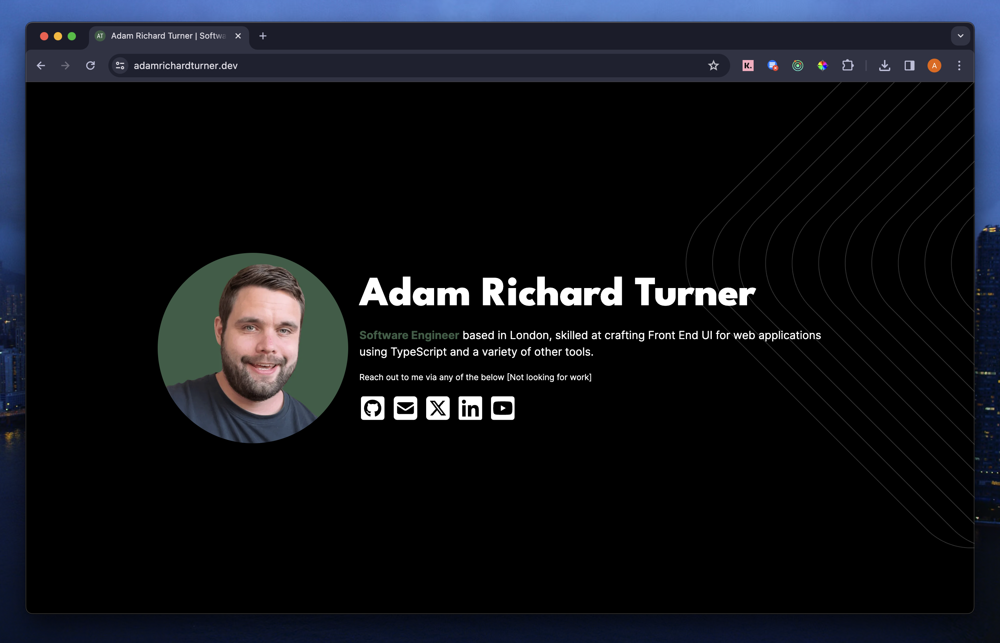

# Adam Turner | Software Engineer Portfolio

This is my minimalist portfolio or web 'contact card', built with Next.js.

It was crafted with a simple design in mind, to serve as a straight forward means to contact myself for professional enquiries.

## Preview



## Live Site

You can view the live site here: [https://adamrichardturner.dev](https://adamrichardturner.dev)

## Getting Started

First clone the project, then run the development server:

```bash
npm run dev
# or
yarn dev
# or
pnpm dev
# or
bun dev
```
